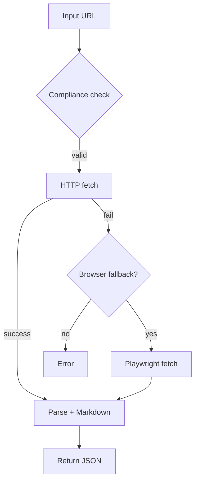

# WeChat Article Reader MCP (Python) 🚀


Recommended repository name: `wechat-article-reader-mcp`
Suggested package name (if publishing to PyPI): `mcp-wechat-reader`
Suggested MCP server ID / client name: `wechat-article-reader`

Read public WeChat articles and convert them to Markdown + structured metadata. 📖
HTTP-first fetching with optional headless browser fallback for tricky pages. 🧭🧩

## Quick Start ✨

### Install from GitHub (no clone needed)

- Using uv (recommended):
  - Base install:
    - `uv pip install "git+https://github.com/<your-github-user>/wechat-article-reader-mcp.git#egg=mcp-wechat-reader"`
  - Enable browser fallback:
    - `uv pip install "git+https://github.com/<your-github-user>/wechat-article-reader-mcp.git#egg=mcp-wechat-reader[browser]"`
    - `playwright install chromium`
  - Enable HTTP MCP server transport:
    - `uv pip install "git+https://github.com/<your-github-user>/wechat-article-reader-mcp.git#egg=mcp-wechat-reader[mcp]"`

- Using pip directly:
  - Base install:
    - `pip install "git+https://github.com/<your-github-user>/wechat-article-reader-mcp.git#egg=mcp-wechat-reader"`
  - With browser fallback:
    - `pip install "git+https://github.com/<your-github-user>/wechat-article-reader-mcp.git#egg=mcp-wechat-reader[browser]"`
    - `playwright install chromium`
  - With MCP server transport:
    - `pip install "git+https://github.com/<your-github-user>/wechat-article-reader-mcp.git#egg=mcp-wechat-reader[mcp]"`

Note: When using VCS URLs with extras (e.g., `[browser]`, `[mcp]`), make sure to wrap the entire URL in quotes.

### Clone and install locally (developer friendly)

- Clone and enter the repo:
  - `git clone https://github.com/<your-github-user>/wechat-article-reader-mcp.git`
  - `cd wechat-article-reader-mcp`
- Install (editable):
  - `uv pip install -e .`
  - With browser fallback: `uv pip install -e .[browser] && playwright install chromium`
  - With MCP server transport: `uv pip install -e .[mcp]`

### Using Python directly
- HTTP-only (no extra deps):
  - `python scripts/read_wechat_cli.py "https://mp.weixin.qq.com/s/<id>" --no-browser`
- Enable browser fallback (recommended for complex pages):
  - `pip install playwright`
  - `playwright install chromium`
  - `python scripts/read_wechat_cli.py "https://mp.weixin.qq.com/s/<id>"`

## Tool API 🧰

- Name: `read_wechat_article`
- Inputs:
  - `url`: string (required), must start with `https://mp.weixin.qq.com/s`
  - `include_images`: boolean (optional, default: true)
  - `force_browser`: boolean (optional, default: false) — force Playwright browser rendering even if HTTP fetch succeeds
- Outputs:
  - `title`, `author`, `pub_time`, `content_md`, `images[]`, `links[]`, `source_url`, `strategy`, `logs`
  - On failure: `error`, `message`

See `.trae/specs/my-mcp-server/read_wechat_article.json` for the spec.

## Configuration ⚙️

Edit `mcp_server_my_mcp_server/utils/config.py`:
- `ua`, `referer`, `accept_language`, `timeout_seconds`
- `rate_limit_per_min`, `burst`
- `proxy` (planned), `cache_ttl_seconds`
- `browser_enabled`

## Integrate with MCP runtime (Trae-like) 🔌

### Bring this project into your Trae app via uv

Option A: Install this project into your Trae app environment
- `uv pip install -e d:/code1/Q5/your-mcp-project`
- With browser fallback: `uv pip install -e d:/code1/Q5/your-mcp-project[browser] && playwright install chromium`

Option B: Declare as a dependency in your Trae app's pyproject.toml
```toml
[project]
dependencies = [
  "mcp-wechat-reader @ file:///d:/code1/Q5/your-mcp-project"
]
```
Then run in your Trae app directory:
- `uv pip install -r pyproject.toml`

### CLI Examples 🛠️

安装完成后，可以直接使用 `read-wechat-cli` 命令：

- 默认开启浏览器回退（需安装浏览器支持）：
  - 安装：`uv pip install -e d:/code1/Q5/your-mcp-project[browser] && playwright install chromium`
  - 运行：`uv run read-wechat-cli https://mp.weixin.qq.com/s/...`

- 仅使用 HTTP（禁用浏览器回退）：
  - 运行：`uv run read-wechat-cli https://mp.weixin.qq.com/s/... --no-browser`

- 输出中包含图片 URL：
  - 运行：`uv run read-wechat-cli https://mp.weixin.qq.com/s/... --include-images`
 
 - 强制使用浏览器渲染（即使 HTTP 成功也走浏览器）：
   - 运行：`uv run read-wechat-cli https://mp.weixin.qq.com/s/... --force-browser`

说明：
- `--no-browser` 现在会生效，CLI 会传入 `WechatReaderConfig(browser_enabled=False)`；若需浏览器回退，请安装 `[browser]` 额外依赖并执行 `playwright install chromium`。
- `--include-images` 控制是否在返回 JSON 的 `images[]` 字段中包含解析到的图片地址。
 - `--force-browser` 会在工具层传入 `force_browser=true`，并且抓取策略返回值中的 `strategy` 将标记为 `browser_forced`。

### Run an HTTP MCP server (for mcpServers URL import) 🌐

1) Install with HTTP transport support:
- `uv pip install -e ./your-mcp-project[mcp]`

2) Run the server (default http://127.0.0.1:8000/mcp/):
- `uv run wechat-mcp-http`

3) In your Trae config (example):
```json
{
  "mcpServers": {
    "wechat-article-reader": {
      "url": "http://127.0.0.1:8000/mcp/",
      "headers": {
        "Authorization": "Bearer <optional-token>"
      }
    }
  }
}
```

If you need auth, add simple token validation at the HTTP layer (FastMCP supports middleware patterns), or place the server behind a reverse proxy enforcing auth.

1. Specs: Ensure `.trae/specs/my-mcp-server/read_wechat_article.json` is present.
2. Registration: Import `src/mcp_server_my_mcp_server/server.py` and register `list_tools()` map.
3. Invocation: Call `read_wechat_article(url, include_images, force_browser)` via your MCP tool dispatcher.
4. Errors: Handle `invalid_url/need_auth/blocked_403/rate_limited_429/timeout/no_content`.

## Notes 📝
- Only public links are supported. Do not use login-required or paid content.
- Images/links may expire; consider downloading to object storage if long-term use is needed.
- Respect site ToS and rate limits.

## Tests ✅

## Screenshots & Demos 📸

Coming soon:
- CLI demo GIF showing HTTP-first vs browser-fallback.
- Architecture diagram (HTTP fetch → parse → Markdown → MCP output).
- Trae configuration screenshot using `mcpServers`.

Example architecture (Mermaid):


- `tests/test_read_wechat_article.py` includes a basic invalid URL test. Add integration tests with real public articles.