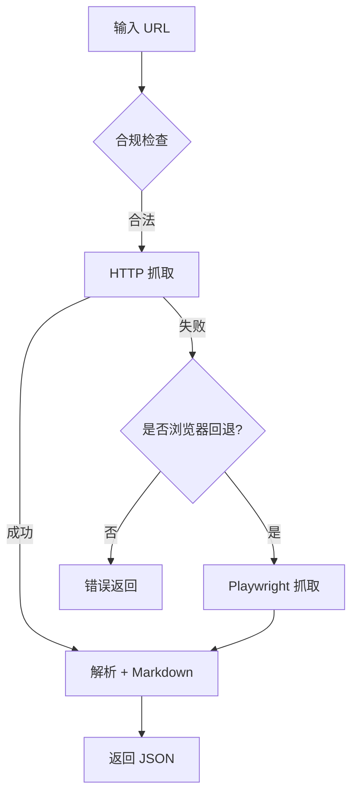

# MCP 微信公众号文章读取工具（wechat-article-reader）

一个基于 Python 的 MCP 工具，用于读取公开的微信公众号文章（mp.weixin.qq.com/s），返回 Markdown 内容与结构化元数据。支持两种传输方式：
- 直接在你的应用中本地调用工具（stdio）
- 通过 FastMCP 提供 HTTP MCP 服务器，以 Trae 的 `mcpServers` URL 配置方式导入

并提供可选的无头浏览器回退（Playwright），在 HTTP 抓取失败时提升成功率。

---

## 特性

- 读取公开的微信公众号文章，返回：标题、作者、发布时间、Markdown 内容、图片链接、外链、源地址等
- 双策略抓取：HTTP（标准库）优先，失败时可选使用浏览器回退（Playwright）
- 基本内容解析与 Markdown 转换
- 简易限流（令牌桶）与结果缓存（TTL）
- 合规控制：仅允许公共 mp.weixin.qq.com/s 链接
- 无外部依赖的 HTTP 抓取（默认），可选启用浏览器支持
- 快速集成到 Trae，通过 `mcpServers` URL 导入，支持可选的 `Authorization: Bearer` 头

---

## 环境要求

- Python >= 3.9
- 推荐使用 `uv` 管理虚拟环境与安装依赖

---

## 目录结构（简化）

```
your-mcp-project/
├── README.md                     # 英文版说明
├── README.zh-CN.md               # 本文件（中文版说明）
├── pyproject.toml
├── scripts/
│   └── read_wechat_cli.py        # 备用脚本入口（与安装脚本功能等价）
├── src/
│   └── mcp_server_my_mcp_server/
│       ├── cli.py                # 包内 CLI 入口：read-wechat-cli
│       ├── fastmcp_server.py     # FastMCP HTTP 服务器入口：wechat-mcp-http
│       ├── server.py             # 工具注册（stdio 场景）
│       ├── tools/
│       │   └── read_wechat_article.py
│       └── utils/                # fetch/parse/config/cache 等工具
└── tests/
    └── test_read_wechat_article.py
```

---

## 快速开始 🚀

1) 创建并激活虚拟环境（Windows 示例）

```powershell
uv venv .venv
.\.venv\Scripts\activate
```

2) 安装（无需本地路径，直接从 GitHub 安装）

使用 uv（推荐）：

```powershell
# 基础安装
uv pip install "git+https://github.com/<your-github-user>/wechat-article-reader-mcp.git#egg=mcp-wechat-reader"

# 开启浏览器回退（建议处理复杂页面）
uv pip install "git+https://github.com/<your-github-user>/wechat-article-reader-mcp.git#egg=mcp-wechat-reader[browser]"
playwright install chromium

# 启用 MCP HTTP 传输支持
uv pip install "git+https://github.com/<your-github-user>/wechat-article-reader-mcp.git#egg=mcp-wechat-reader[mcp]"
```

使用 pip 也可以：

```powershell
pip install "git+https://github.com/<your-github-user>/wechat-article-reader-mcp.git#egg=mcp-wechat-reader"
pip install "git+https://github.com/<your-github-user>/wechat-article-reader-mcp.git#egg=mcp-wechat-reader[browser]"
playwright install chromium
pip install "git+https://github.com/<your-github-user>/wechat-article-reader-mcp.git#egg=mcp-wechat-reader[mcp]"
```

注意：使用 VCS URL 并带有 extras（如 `[browser]`、`[mcp]`）时，请务必为整个 URL 加上引号。

3) 本地克隆并安装（适合开发者）

```powershell
git clone https://github.com/<your-github-user>/wechat-article-reader-mcp.git
cd wechat-article-reader-mcp
uv pip install -e .
uv pip install -e .[browser]
playwright install chromium
uv pip install -e .[mcp]
```

---

## CLI 使用示例 🛠️

安装完成后，可以直接使用 `read-wechat-cli`：

- 默认开启浏览器回退（需完成第 3 步的安装）：

```powershell
uv run read-wechat-cli https://mp.weixin.qq.com/s/...
```

- 仅使用 HTTP（禁用浏览器回退）：

```powershell
uv run read-wechat-cli https://mp.weixin.qq.com/s/... --no-browser
```

- 输出中包含图片 URL：

```powershell
uv run read-wechat-cli https://mp.weixin.qq.com/s/... --include-images
```

- 强制使用浏览器渲染（即使 HTTP 成功也走浏览器）：

```powershell
uv run read-wechat-cli https://mp.weixin.qq.com/s/... --force-browser
```

说明：
- `--no-browser` 会生效，CLI 会传入 `WechatReaderConfig(browser_enabled=False)`。如需浏览器回退，请确保已安装 `[browser]` 额外依赖并执行 `playwright install chromium`。
- `--include-images` 控制是否在返回 JSON 的 `images[]` 字段中包含解析到的图片地址。
 - `--force-browser` 会在工具层传入 `force_browser=true`，并且返回结果中的 `strategy` 将标记为 `browser_forced`。

---

## 通过 Trae 的 mcpServers（URL）导入

1) 启动本项目的 FastMCP HTTP 服务器：

```powershell
uv run wechat-mcp-http
# 默认服务地址：http://127.0.0.1:8000/mcp/
```

2) 在 Trae 的配置文件中添加（带可选 Authorization 头）：

```json
{
  "mcpServers": {
    "wechat-article-reader": {
      "url": "http://127.0.0.1:8000/mcp/",
      "headers": {
        "Authorization": "Bearer <optional-token>"
      }
    }
  }
}
```

3) 无认证头的简化配置：

```json
{
  "mcpServers": {
    "wechat-article-reader": {
      "url": "http://127.0.0.1:8000/mcp/"
    }
  }
}
```

说明：
- FastMCP 默认 HTTP 路径为 `/mcp/`。如果你的环境必须使用 `/sse`，可以通过反向代理做路径改写，或在服务器层做路由别名。
- 当前示例未强制校验 `Authorization`，如需认证可在 HTTP 层添加中间件或使用带鉴权的反向代理。

---

## 工具规范（接口）🧰

- 工具名：`read_wechat_article`
- 输入参数：
  - `url`（string，必填）：微信公众号文章链接，必须是 `https://mp.weixin.qq.com/s/...`
  - `include_images`（boolean，可选，默认 `true`）：是否返回图片 URL 列表
  - `force_browser`（boolean，可选，默认 `false`）：即使 HTTP 抓取成功也强制使用浏览器渲染
- 输出字段：
  - `title`、`author`、`pub_time`
  - `content_md`（Markdown 解析后的正文）
  - `images[]`、`links[]`
  - `source_url`（清洗后的源链接）
  - `strategy`（`http` / `browser_fallback` / `browser_forced` / `http_failed`）
  - `logs`（抓取日志，含 HTTP 与浏览器抓取的细节）
- 错误返回（部分）：
  - `error`: `invalid_url` / `blocked_403` / `rate_limited_429` / `timeout` / `no_content`
  - `message`: 文本说明

---

## 配置说明（utils/config.py）⚙️

可以根据需要修改或在调用时传入 `WechatReaderConfig`：

- `ua`：User-Agent（默认包含 `MicroMessenger/8.0`）
- `referer`：HTTP Referer（默认 `https://mp.weixin.qq.com/`）
- `accept_language`：默认 `zh-CN,zh;q=0.9`
- `timeout_seconds`：请求超时（默认 15s）
- `rate_limit_per_min` / `burst`：每分钟限速与突发容量
- `proxy`：代理（计划中，目前未启用）
- `cache_ttl_seconds`：缓存 TTL（默认 24 小时）
- `download_assets`：是否下载资产（未实现，保留字段）
- `browser_enabled`：是否启用浏览器回退（默认 `true`）

浏览器回退依赖 Playwright：

```powershell
uv pip install -e d:/code1/Q5/your-mcp-project[browser]
playwright install chromium
```

---

## 合规与限制

- 仅支持公开的 `mp.weixin.qq.com/s` 文章链接（不支持登录/付费内容）
- 请遵守网站的使用条款与访问频率限制
- 图片与外链可能随时间失效，如需长期保存，请考虑下载到对象存储
- 若 HTTP 抓取频繁失败（403/超时），建议开启浏览器回退或使用合理的代理

---

## 故障排查（常见错误）

- `invalid_url`：链接不符合公共文章格式（检查是否为 `https://mp.weixin.qq.com/s/...`）
- `blocked_403`：被站点屏蔽，建议：
  - 启用浏览器回退（安装 Playwright）
  - 保持 UA 中含 `MicroMessenger/8.0` 与正确的 `Referer`
  - 控制请求频率（限流）
- `timeout` / `no_content`：网络不稳定或页面为动态渲染，建议：
  - 启用浏览器回退
  - 检查网络与代理设置
- `rate_limited_429`：被限流，减少并发与频次，等待一段时间后再试

---

## 测试

- 基本测试位于 `tests/test_read_wechat_article.py`，包含无效链接的校验用例
- 建议添加真实公开文章的集成测试，并分别覆盖 HTTP-only 与浏览器回退场景

---

## 截图与演示 📸（即将发布）

- CLI 演示 GIF：展示 HTTP 优先与浏览器回退。
- 架构示意图：HTTP 抓取 → 解析 → Markdown → MCP 输出。
- Trae 配置截图：`mcpServers` 的示例配置。

示例架构（Mermaid）：



---

## 许可与鸣谢 🏷️

- 版权：Your Team
- 许可：根据你团队的实际选择（此处未包含许可证文本）
- 感谢 FastMCP 与 MCP 社区提供的框架与规范

---

## 反馈与支持

- 如果你需要：
  - 在 HTTP 服务器上增加 Bearer Token 认证中间件
  - 支持 `/sse` 路径或通过反向代理进行路径重写
  - 增强解析器与代理支持
  - 统一 CLI 默认行为或补充更多示例

请提出具体需求，我们可以进一步完善实现与文档。